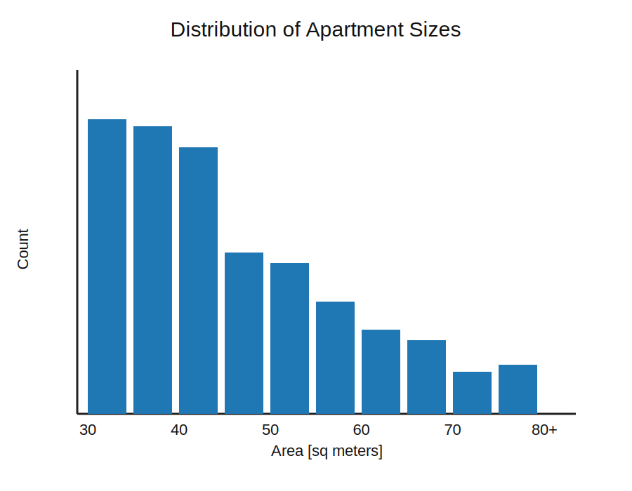
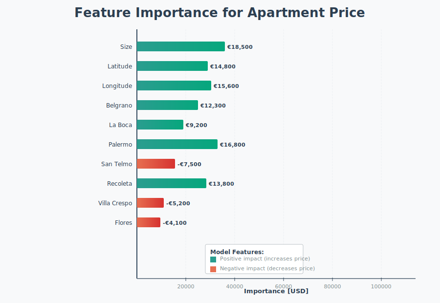

# Housing Price Prediction in Buenos Aires

This project builds a sequence of apartment price models for Buenos Aires real estate data. It starts with a simple size-based regression, then adds geographic location, neighborhood, and broader feature sets to improve prediction quality. The repository also includes a Mexico City assignment notebook that follows the same modeling workflow on a separate dataset.

## Project Highlights

- Clean and wrangle multiple CSV files with reusable functions
- Explore how apartment size, location, and neighborhood affect price
- Train linear regression and Ridge regression models
- Handle missing values and categorical variables with scikit-learn pipelines
- Compare each model against a baseline using mean absolute error
- Interpret coefficients and feature importances

## Notebook Sequence

### `021-price-and-size.ipynb`
The first notebook builds a baseline model using apartment size as the only feature.

### `022-price-and-location.ipynb`
This notebook adds latitude and longitude, showing how apartment price changes with location.

### `023-price-and-neighborhood.ipynb`
Neighborhood becomes the main location feature here, with one-hot encoding used to turn categories into model inputs.

### `024-price-and-everything.ipynb`
The full Buenos Aires workflow combines size, location, neighborhood, imputation, and regularization for a more complete model.

### `025-assignment.ipynb`
A related practice notebook applies the same approach to Mexico City apartment data, including wrangling, visualization, and a Ridge regression pipeline.

## Visual Summary

The notebooks show the progression from simple to more expressive modeling:

- Price vs. size
- Price vs. location
- Price vs. neighborhood
- Multi-feature regression with preprocessing
- Feature importance and model interpretation

## Tools Used

- `pandas` for data wrangling
- `matplotlib` and `seaborn` for static charts
- `plotly` for interactive geographic and 3D visualizations
- `scikit-learn` for regression, imputation, pipelines, and evaluation
- `category_encoders` for encoding categorical variables
- `ipywidgets` for interactive exploration

## Repository Contents

- `021-price-and-size.ipynb`
- `022-price-and-location.ipynb`
- `023-price-and-neighborhood.ipynb`
- `024-price-and-everything.ipynb`
- `025-assignment.ipynb`
- `assets/`
- `data/`

## Notes

The visuals above are static SVG exports embedded directly in the README. The full interactive versions remain inside the notebooks.
